# YT Subscription Manager

**A free, private command center for your YouTube library**, as a Chrome extension. It covers subscriptions, categories, playlists, Watch Later, watch analytics and cleanup in one dashboard.

- 🔒 **Local-first.** Your data stays in your browser. There are no servers, no ads, no tracking and no paid tiers.
- 🔑 **Official Google sign-in, read-only by default.** Permission to change anything is asked for only when you first make a change.
- 🛡️ **Nothing destructive happens without your confirmation.** Everything you remove is recorded so you can restore it.

> Not affiliated with, endorsed by, or sponsored by YouTube or Google.

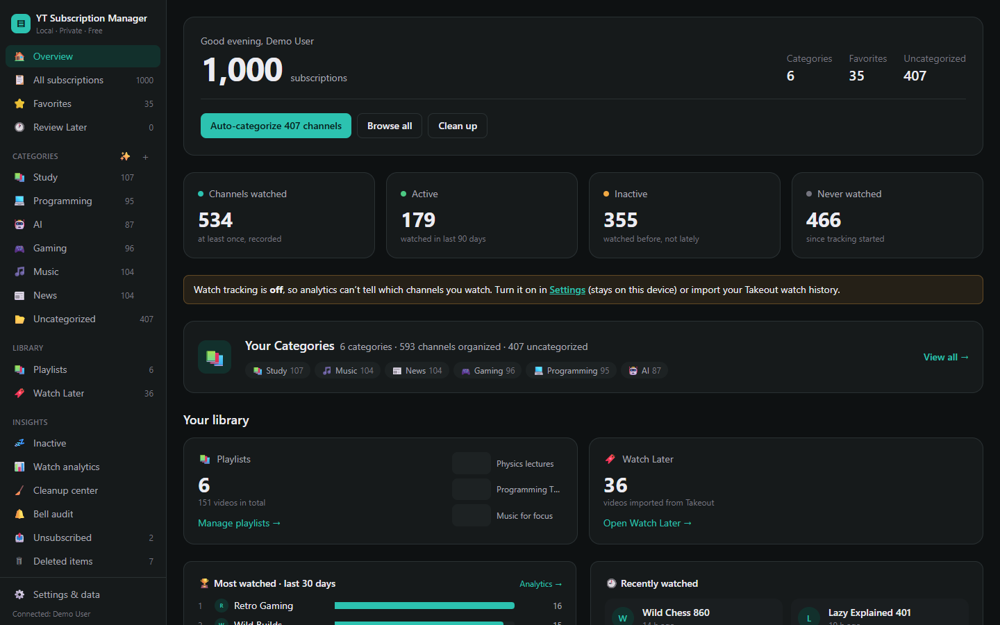

### App flow — every screen at a glance

How the app is organised: start → connect → Overview, then one lane per area. Badges show what each screen uses: the **official YouTube API**, **YouTube's website in your tab**, **local only**, or **asks for confirmation**. Numbers match the order in [How to use](#3-how-to-use).

[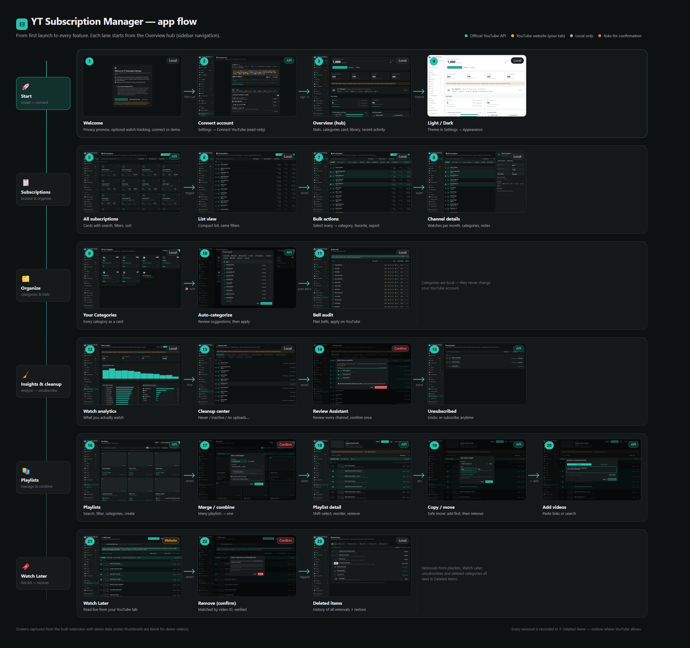](docs/screenshots/00-app-flow.png)

<sub>Click the image to open it full size. Source: [docs/app-flow.html](docs/app-flow.html). Open it in a browser, or re-render it after changing screenshots.</sub>

---

## Contents

1. [Install](#1-install)
2. [Connect your YouTube account](#2-connect-your-youtube-account)
3. [How to use](#3-how-to-use)
   - [Overview](#overview)
   - [Subscriptions](#subscriptions)
   - [Categories & auto-categorize](#categories--auto-categorize)
   - [Watch analytics](#watch-analytics)
   - [Cleanup center & safe unsubscribe](#cleanup-center--safe-unsubscribe)
   - [Unsubscribed (undo)](#unsubscribed-undo)
   - [Bell audit](#bell-audit)
   - [Playlists](#playlists)
   - [Watch Later](#watch-later)
   - [Deleted items (history & restore)](#deleted-items-history--restore)
   - [Settings, backup & privacy](#settings-backup--privacy)
4. [Limits you should know](#4-limits-you-should-know)
5. [For developers](#5-for-developers)

---

## 1. Install

You need **Google Chrome** for sign-in. Brave, Edge and Opera block Chrome-extension Google sign-in. Demo data and imports still work there.

```bash
npm install
npm run build          # → .output/chrome-mv3
```

1. Open `chrome://extensions` and turn on **Developer mode** (top-right).
2. Click **Load unpacked** and choose the `.output/chrome-mv3` folder.
3. Click the extension icon. The dashboard opens in a tab.

The first screen explains what is stored and lets you turn on watch tracking. It's optional and off by default. You can then connect your account or **explore with demo data**.

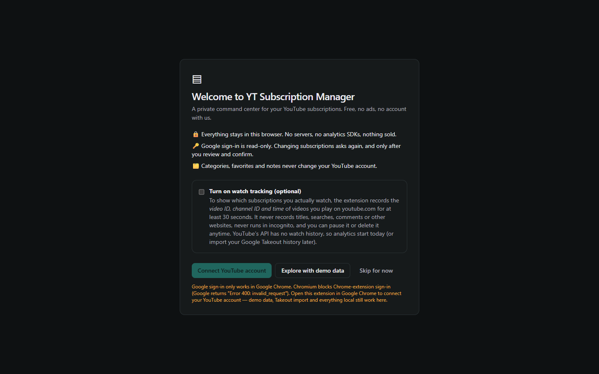

> **After updating the code:** run `npm run build` again, then click **reload ↻** on the extension in `chrome://extensions`. If you only refresh the tab, a yellow banner offers **Reload extension**.

## 2. Connect your YouTube account

This is a one-time setup that takes about 10 minutes and costs nothing. Create a Google OAuth client of type **Chrome extension**, then put its ID in `.env`:

```
WXT_EXTENSION_KEY=...      # keeps the extension ID stable (already set)
WXT_OAUTH_CLIENT_ID=...    # your OAuth client ID
```

Step-by-step instructions: **[SETUP.md](SETUP.md)**. After rebuilding, open **Settings → Connect YouTube account** and sign in with an account listed under *Test users*. Your subscriptions sync, and new subscriptions are categorised automatically.

> **No sign-in?** You can still use the extension. Import `subscriptions.csv` and `watch-history.json` from [Google Takeout](https://takeout.google.com/) in Settings, or load demo data.

---

## 3. How to use

### Overview

Your home screen shows:
- total subscriptions, favorites and uncategorized channels;
- channels watched, active, inactive and never watched;
- a compact **Your Categories** card (click it for the full categories page);
- **Your library** (Playlists and Watch Later);
- most watched in the last 30 days, and recently watched.

The light theme looks like this. Choose System, Light or Dark in Settings.

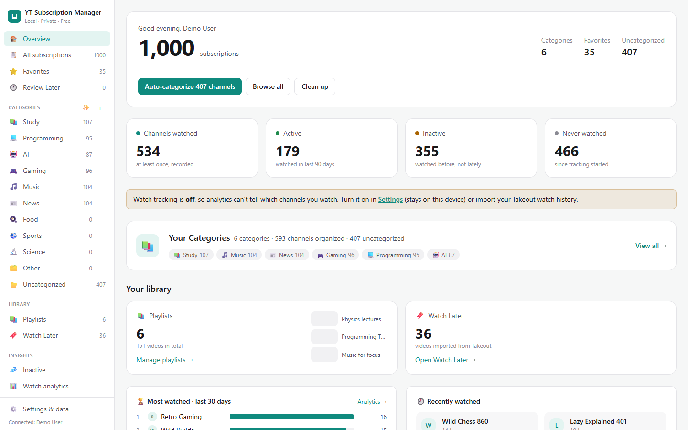

### Subscriptions

**📋 All subscriptions** shows every channel as a **card** or in a compact **list**; toggle at the top-right.

- **Search** with `/`. It matches channel names, categories and notes.
- **Filter** by category, watch status (watched / never / active / inactive) and bell plan.
- **Sort** by name, last watched, most watched, latest upload or subscription date.
- Click a channel to open **details**: watches per month, categories, favorite, review later and a private note.

| Cards | List |
|---|---|
| 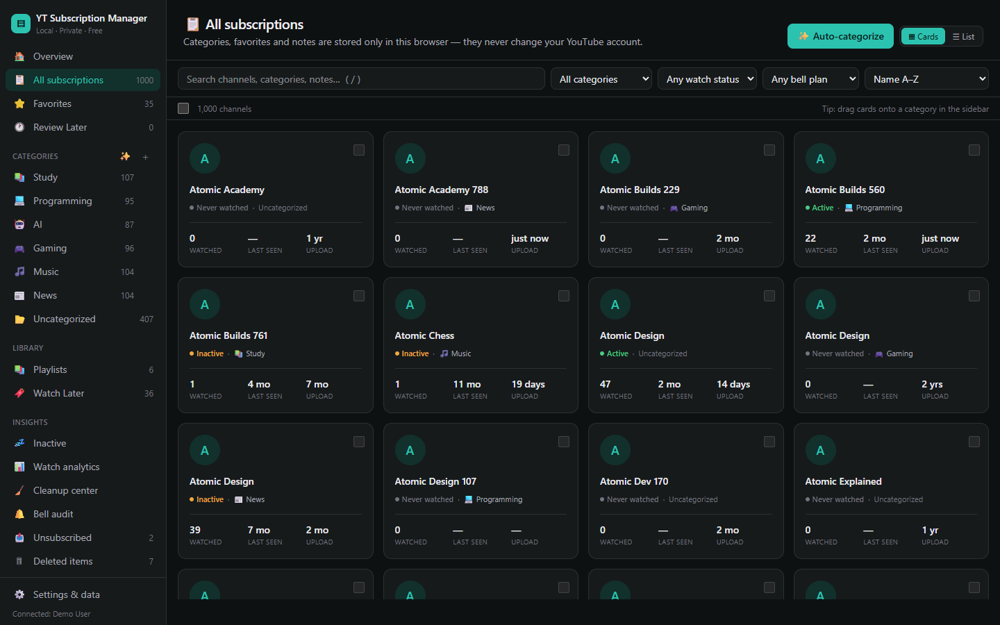 | 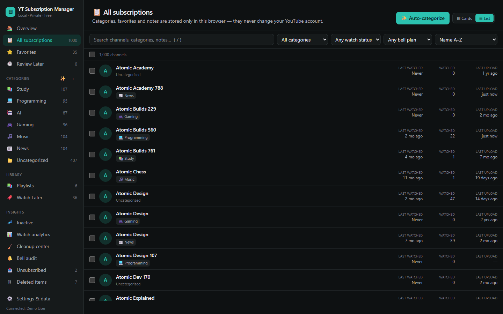 |

**Selecting many channels:** tick checkboxes (or *select all*), then use the bulk bar:

- add to or remove from a category;
- ⭐ favorite;
- 🕐 review later;
- export;
- **Unsubscribe…** (see Cleanup).

You can also **drag** channels onto a category in the sidebar.

| Bulk actions | Channel details |
|---|---|
| 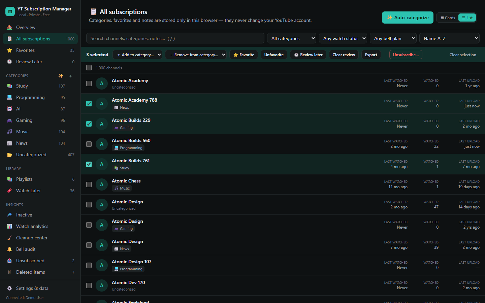 | 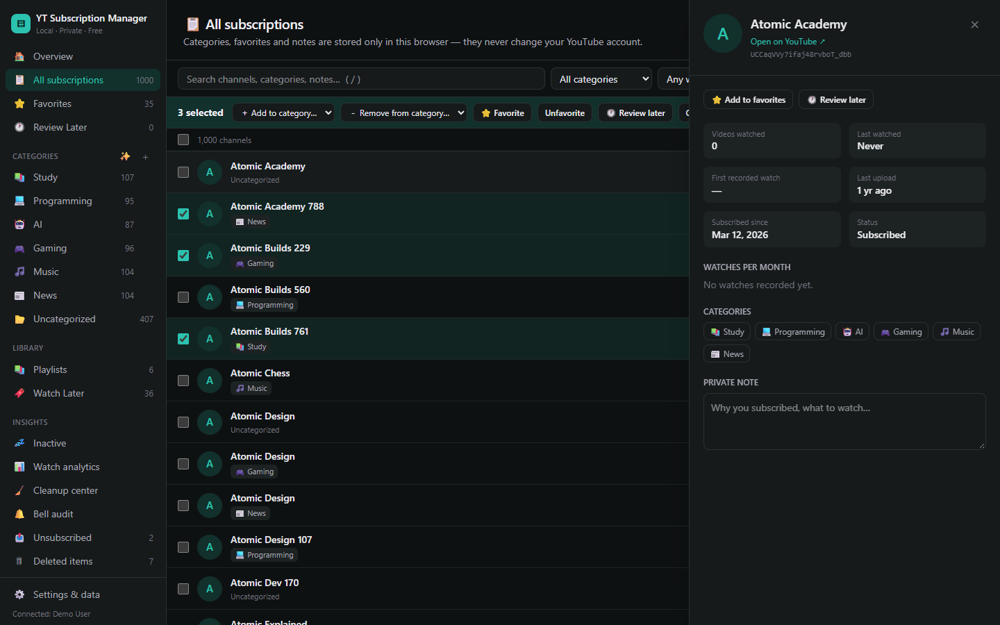 |

### Categories & auto-categorize

Open **📚 Your Categories** from the Overview card, or click *CATEGORIES* in the sidebar. Every category is a card showing its channel count, top channels and how many are active. Click a card to see its channels.

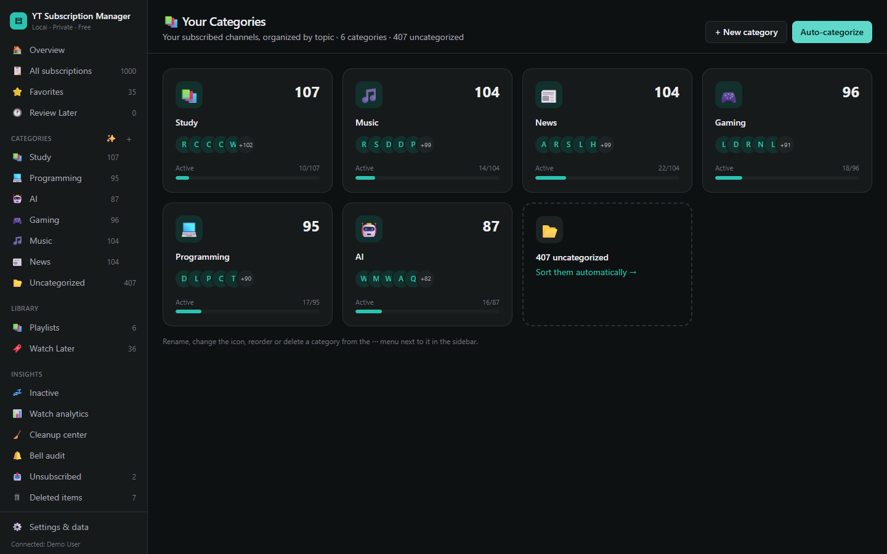

**✨ Auto-categorize** sorts channels for you. It uses each channel's name, YouTube's topic data and its description, and understands Hindi/Hinglish words too. You **review every suggestion** and can change or skip any channel before pressing **Apply**. It only adds categories and never removes yours.

Manage categories from the sidebar:
- **+** creates a category;
- **⋯** next to a category lets you rename it, change its icon, reorder it or delete it.

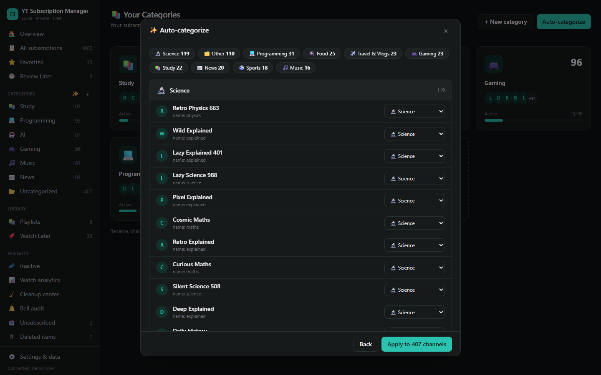

Categories live only in this browser and **never change your YouTube account**.

### Watch analytics

Turn on **Settings → Watch tracking** to record which channels you actually watch. It records only the video ID, channel ID and time, stays on your device and never runs in incognito.

YouTube's API has no watch history, so analytics start from today. To see your past viewing, **import your Takeout `watch-history.json`** in Settings.

The page shows:
- videos watched per week;
- most watched channels;
- share by category;
- how often you watch;
- channels you watch but aren't subscribed to.

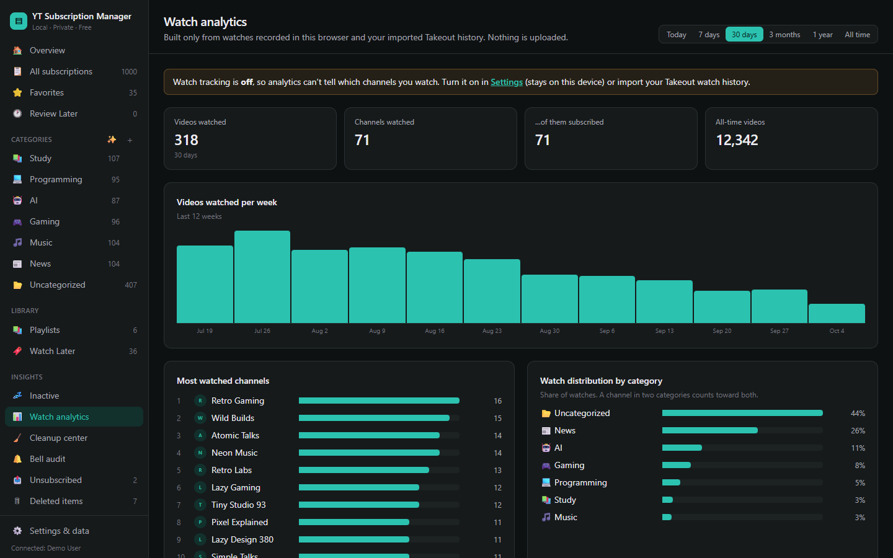

### Cleanup center & safe unsubscribe

**🧹 Cleanup center** suggests channels to review. Pick one or more signals:

- never watched;
- not watched in 30 / 90 / 180 / 365 days;
- no uploads in 6 / 12 months;
- low activity;
- uncategorized;
- your Review Later list.

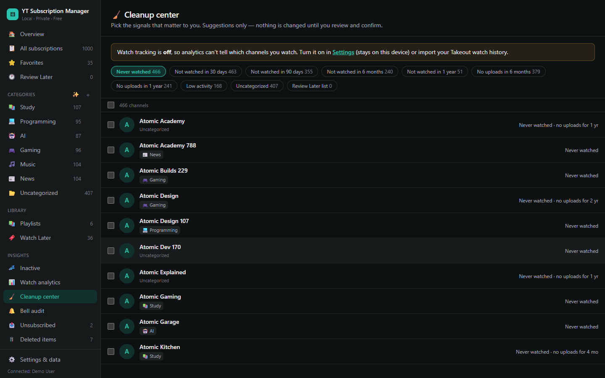

Select channels, then click **Unsubscribe…** to open the **Review Assistant**:

1. Scroll through **every** channel. Untick any you want to keep.
2. Tick **"OK, I have reviewed these channels and I confirm"**.
3. Click **Unsubscribe N channels**. It runs automatically with progress and a **Stop** button. If the daily limit is reached, it continues the next day.

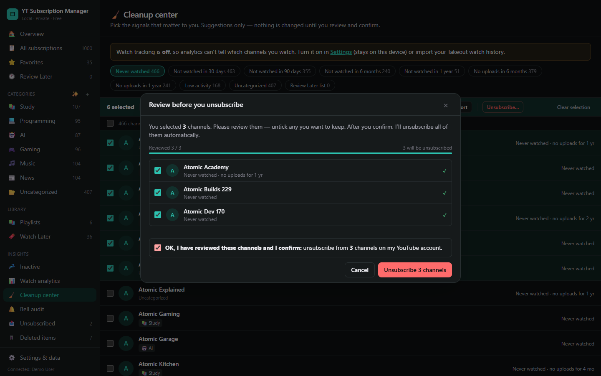

### Unsubscribed (undo)

**📤 Unsubscribed** lists every channel you unsubscribed through the extension. Made a mistake? **Re-subscribe**, one channel or many. Its categories and favorite come back too.

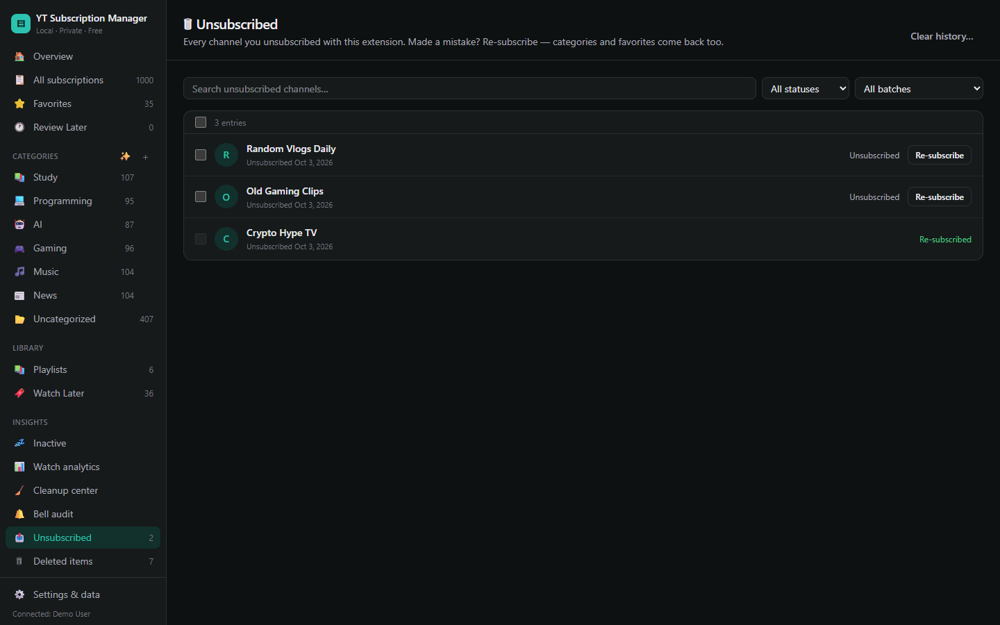

### Bell audit

YouTube doesn't let apps change notification bells. **🔔 Bell audit** lets you plan them instead:
1. Choose **All / Personalized / None** per channel. Bulk by category works too.
2. Press **Open ↗** and set the bell on YouTube.
3. Tick **Done**. Your progress is saved.

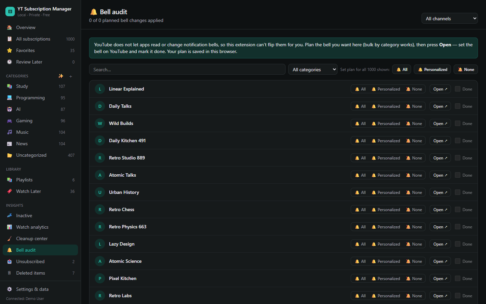

### Playlists

**📚 Playlists** (sidebar → Library) shows all your playlists. Press **Refresh** to load them.

- **Search, filter** by privacy or category, **sort**.
- **+ Create playlist**, choosing name, description and privacy.
- **✨ Auto-categorize** playlists, or add categories to selected playlists. These are local only.
- **Select several playlists** to **Merge / combine** or **Delete…** them.

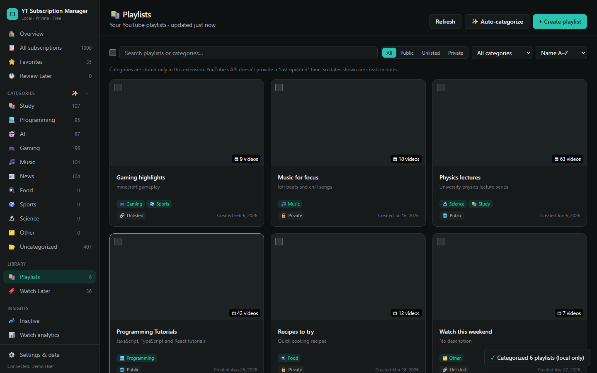

**Merge / combine** copies the videos of the selected playlists into an existing playlist or a new one:
- each video is added once, and videos already in the target are skipped;
- you can optionally delete the source playlists, **but only if every video was added successfully**.

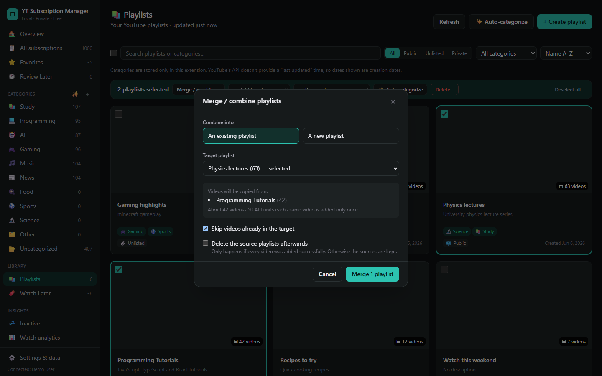

**Open a playlist** to manage its videos:

- Tick videos. **Shift + click** selects a range.
- **Add to playlist / Move…** copies or moves them. A move removes a video from the source only after YouTube confirms it was added.
- **Remove…** asks for confirmation, then shows progress, Stop and Retry failed.
- **Drag ☰** to reorder. The new order shows only after YouTube confirms. The playlist must use *Manual* sorting on YouTube.
- **Remove duplicates** appears when a video is in the playlist twice.
- **Edit**, **Delete**, **Open on YouTube**.

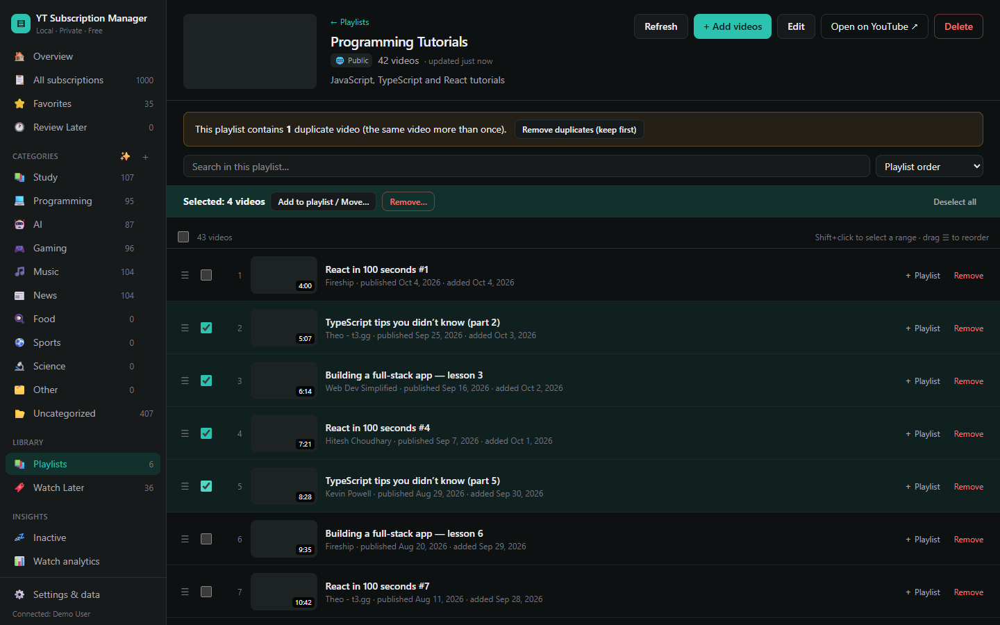

| Add / copy / move | Add videos (paste links or search) |
|---|---|
| 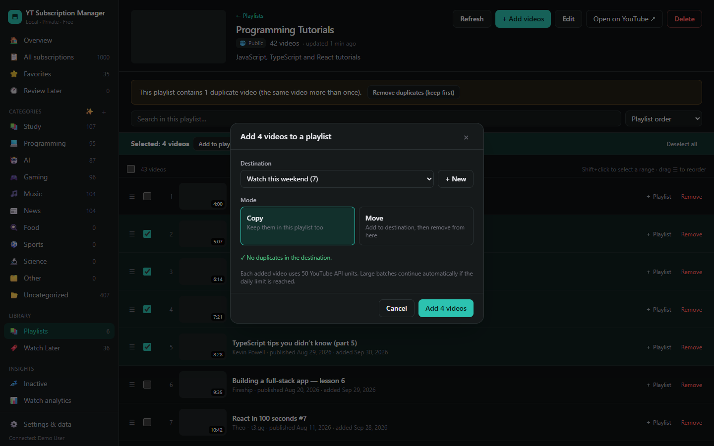 | 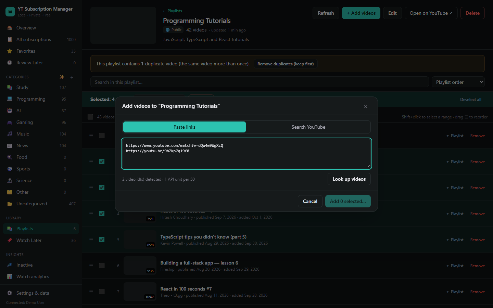 |

**+ Add videos:** paste YouTube links or video IDs; this is unlimited and cheap. You can also search YouTube, but search is limited to about 100 times a day. Duplicates are skipped by default.

### Watch Later

**🔖 Watch Later** manages your **real** YouTube Watch Later list.

1. Sign in to youtube.com in Chrome.
2. Press **Refresh from YouTube**. A YouTube tab opens on your Watch Later page; keep it open. The list is read from that page and labelled **● Live YouTube Watch Later**.
3. Select videos, then choose an action:
   - **Add to Playlist** copies them through the official API.
   - **Move to Playlist** adds them to the playlist first, then removes them from Watch Later.
   - **Remove from YouTube Watch Later** uses YouTube's own *Remove from Watch later* option for each video, matched by video ID, and checks it's gone.
   - **Hide here** hides videos in this extension only.

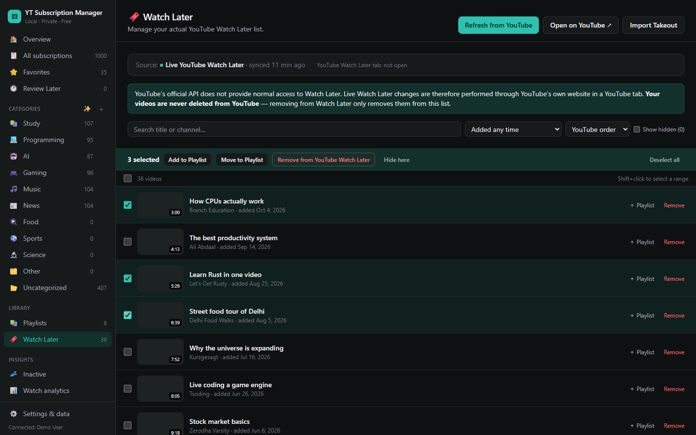

You always confirm first. **Videos are never deleted from YouTube**; they're only removed from your Watch Later list.

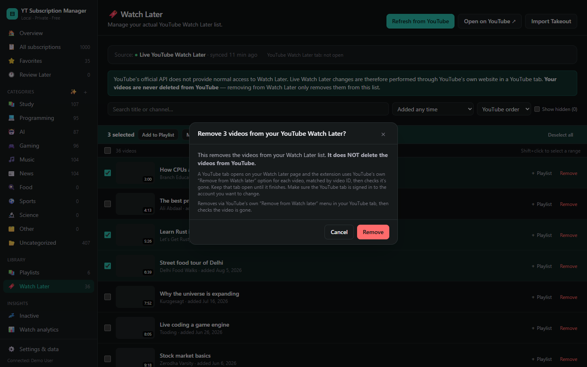

> YouTube's official API has no access to Watch Later, so live changes go through YouTube's own website in your tab. If your YouTube language isn't English or another common language, switch it to English if removal reports "option not found". You can also **Import Takeout** (`Watch later-videos.csv`), shown as a local snapshot.

### Deleted items (history & restore)

**🗑 Deleted items** records everything removed through the extension, by type, with restore where YouTube allows:

| Tab | Restore |
|---|---|
| 📺 Channels (unsubscribed) | Re-subscribe (Unsubscribed dashboard) |
| 🎞️ Playlist videos (removed / moved) | **Add back** to the original playlist |
| 📚 Playlists (deleted / merged) | **Recreate** with the same name, privacy and videos (new link) |
| 🔖 Watch Later | Can't be added back (no API). **Copy to playlist** instead. |
| 🏷️ Categories | **Restore** with all assignments |

Search, filter by date, **Export** as JSON, or **Clear history**. Clearing only affects this list.

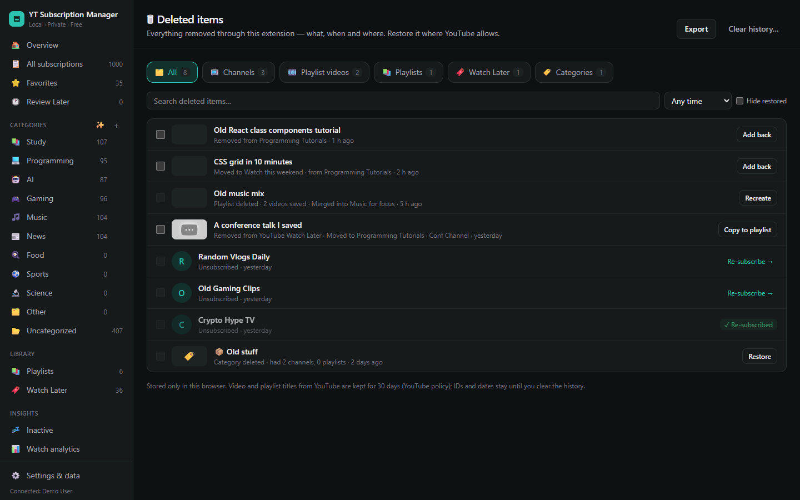

### Settings, backup & privacy

The **⚙️ Settings & data** page covers:

| Section | What you can do |
|---|---|
| **YouTube account** | Connect, Sync now, Disconnect (revokes access and deletes YouTube data), API usage today |
| **Watch tracking** | On/off, count after N seconds, keep history for…, inactive after N days, never track certain channels |
| **Organization** | Auto-categorize new subscriptions |
| **Google Takeout import** | Watch history and subscriptions |
| **Backup & restore** | Export everything as JSON; import it later (merge or replace) |
| **Appearance** | System / Light / Dark |
| **Demo data** | Load or remove |
| **Danger zone** | Reset analytics, reset everything |

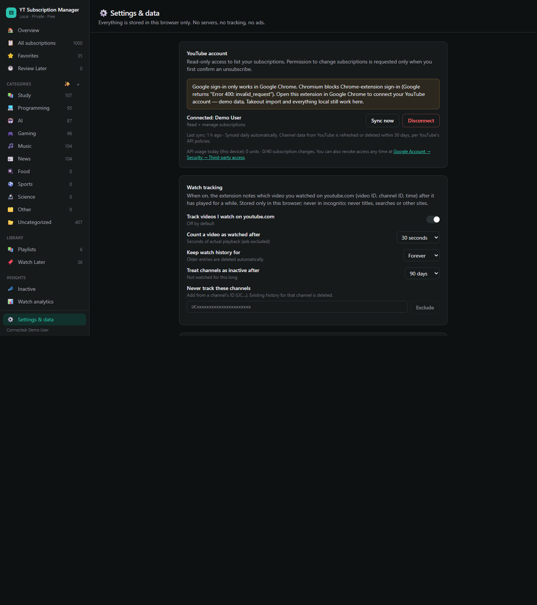

**Privacy in one line:** everything is stored in your browser, nothing is sent anywhere except directly to Google's official APIs, and no passwords, cookies or tokens are ever stored. Full policy: [PRIVACY.md](PRIVACY.md), also inside the extension.

---

## 4. Limits you should know

| Limit | Why | What to do |
|---|---|---|
| About **40 subscription changes and 150 playlist changes per day** | YouTube's free API quota is shared, and each change costs 50 units | Big jobs pause and **continue automatically** after the daily reset |
| Search ≈ 100 per day for everyone | YouTube's separate search limit | Paste video links instead |
| Watch analytics start from install | YouTube's API has no watch history | Import Takeout `watch-history.json` |
| Notification bells can't be changed | No API for it | Use **Bell audit** |
| Watch Later needs an open, signed-in YouTube tab | No API for Watch Later | Keep the tab open during removals |
| Reorder needs Manual sorting | YouTube API rule | Set the playlist to *Manual* on YouTube |
| Sign-in works only in Google Chrome | Other Chromium browsers block it | Use Chrome to connect |
| Titles and thumbnails from YouTube are kept 30 days | YouTube API policy | Refreshed automatically while connected |

---

## 5. For developers

| Command | Purpose |
|---|---|
| `npm run dev` | Dev mode with hot reload |
| `npm run build` | Production build (`.output/chrome-mv3`) |
| `npm run zip` | Chrome Web Store ZIP |
| `npm test` | Unit and integration tests (Vitest, fake IndexedDB, jsdom) |
| `npm run compile` | Type-check |

**Stack:** WXT (Manifest V3), React 19, TypeScript, Tailwind 4, Dexie (IndexedDB), zod.

```
src/
  entrypoints/   background.ts (service worker: OAuth, API, alarms, queues)
                 youtube.content.ts (watch tracking + Watch Later page actions)
                 dashboard/ (React app)
  services/      youtube-api, auth, sync, queue, bulk, playlists, playlist-ops, wl-live, trash, takeout, backup…
  features/      pure logic: filters, analytics, categorize, wl-dom (Watch Later page actions)
  db/            Dexie schema (v1–v4), local operations, deletion log
  ui/            pages, components, dialogs
tests/           163 tests
```

**More docs:**
- [SETUP.md](SETUP.md): OAuth client and store IDs
- [docs/playlist-manager.md](docs/playlist-manager.md): playlists, Watch Later, bulk engine, deleted items
- [docs/permissions.md](docs/permissions.md): permission justifications
- [docs/security-review.md](docs/security-review.md)
- [docs/release-checklist.md](docs/release-checklist.md)
- [context.md](context.md): design decisions

Screenshots in `docs/screenshots/` were captured from the built extension with demo data. Thumbnails are blank because demo videos aren't real.
